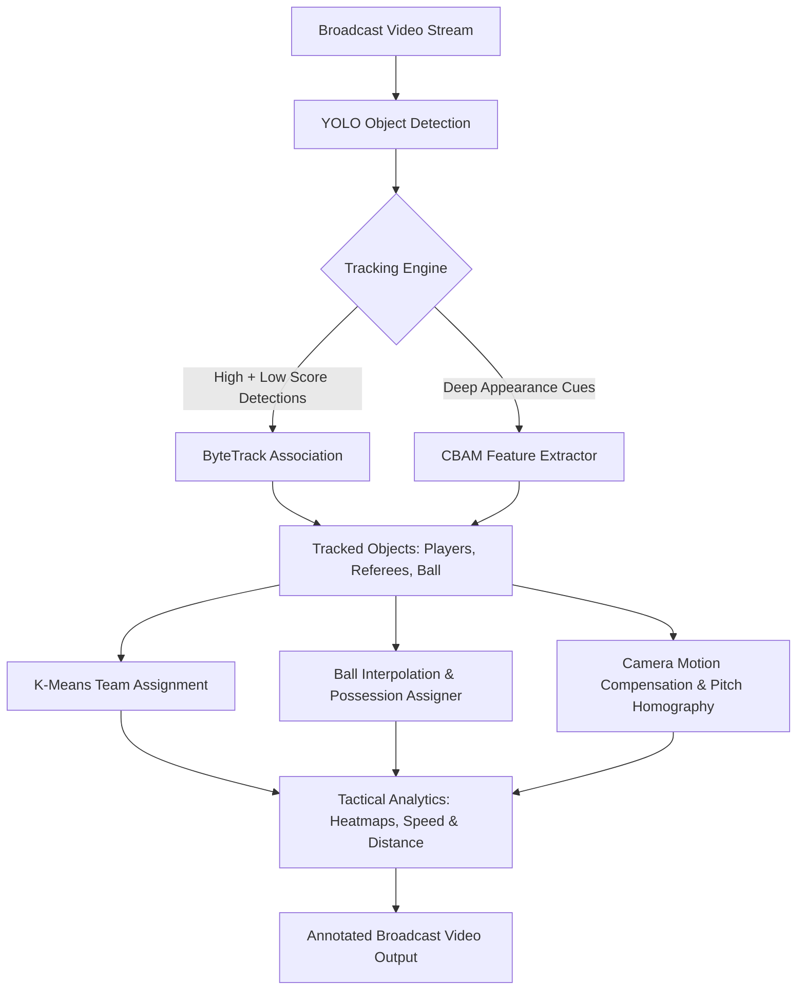

# ⚽ AI Multi-Object Tracking (MOT) & Tactical Football Analytics


An advanced computer vision pipeline for automated football (soccer) match analysis, featuring multi-object detection, deep appearance-based tracking (ByteTrack + CBAM), automatic team clustering, ball possession detection, camera motion compensation, and tactical analytics (speed, distance, and player density heatmaps).

---

## 📌 Key Capabilities



- **Multi-Class Detection**: YOLO models trained to detect players, referees, and the match ball.
- **DeepByteTrack with CBAM**: Integration of Convolutional Block Attention Module (CBAM) into ByteTrack to capture robust spatial and channel attention features, drastically reducing ID switches during occlusions.
- **Dynamic Team Assignment**: Automatic clustering of jersey colors in HSV/RGB space using K-Means to categorize players into Team A, Team B, and Referees.
- **Ball Possession & Interpolation**: Trajectory smoothing and spatial proximity calculation to accurately assign ball possession and handle temporary ball occlusions.
- **Tactical Analytics**:
  - Distance traveled and instantaneous speed estimation.
  - 2D pitch view transformation and spatial density heatmaps.
  - Ellipse & triangle bounding marker visualizations with team color coding.

---

## 📂 Project Architecture

```
Project/
├── deep_bytetrack_tracker/     # ByteTrack integrated with CBAM appearance feature extractor
│   ├── CBAM_feature_extractor.py
│   └── DeepByteTracker.py
├── player_ball_assigner/       # Proximity and trajectory based ball possession logic
│   └── player_ball_assigner.py
├── team_assigner/              # K-Means jersey color clustering for team assignment
│   └── team_assigner.py
├── trackers/                   # Multi-class and single-class tracking engines
│   ├── tracker.py
│   ├── tracker_1cls.py
│   ├── tracker_metrics.py
│   └── DeepByteTracker.py
├── utils/                      # Video I/O and bounding box transformations
│   ├── bbox_utils.py
│   └── video_utils.py
├── 1cls_MOT.py                 # Single-class MOT execution script (Players only)
├── 3cls_MOT.py                 # Full 3-class MOT execution script (Players, Referees, Ball)
├── Demo.ipynb                  # Interactive walkthrough and visualization notebook
├── heatmap.ipynb               # Player positional density heatmap generation
└── demo.md                     # Video demonstration descriptions
```

---

## 🛠️ Installation & Setup

1. **Clone the repository and navigate to the project directory:**
   ```bash
   git clone https://github.com/merfan-bagheri/Deep_learning_Dr.Fatemizadeh.git
   cd Deep_learning_Dr.Fatemizadeh/Project
   ```

2. **Install required dependencies:**
   ```bash
   pip install torch torchvision opencv-python numpy pandas matplotlib scikit-learn ultralytics supervision
   ```

3. **Download Model Checkpoints:**
   Place your trained YOLO weights (`f_v5s_1cls.pt` or `f_v5s_3cls.pt`) in the `models/` directory.

---

## 🚀 Usage

### 1. Run 3-Class Tracking & Tactical Analysis
Executes the full pipeline with player tracking, team clustering, ball possession, speed, and distance estimation:
```bash
python 3cls_MOT.py
```

### 2. Run 1-Class Player Tracking
For lightweight single-class tracking:
```bash
python 1cls_MOT.py
```

### 3. Generate Spatial Heatmaps
Launch Jupyter Notebook to visualize positional density:
```bash
jupyter notebook heatmap.ipynb
```

---

## 📊 Methodological Highlights

- **CBAM Attention**: Combines channel attention (what features are meaningful) and spatial attention (where the object is located) to extract discriminative player appearance embeddings.
- **ByteTrack Two-Stage Association**: Matches high-confidence detections first, then uses low-confidence detections to recover occluded players without dropping tracks.
- **Spatial Filtering**: Filters out spectator and bench detections by enforcing pitch boundary constraints.
