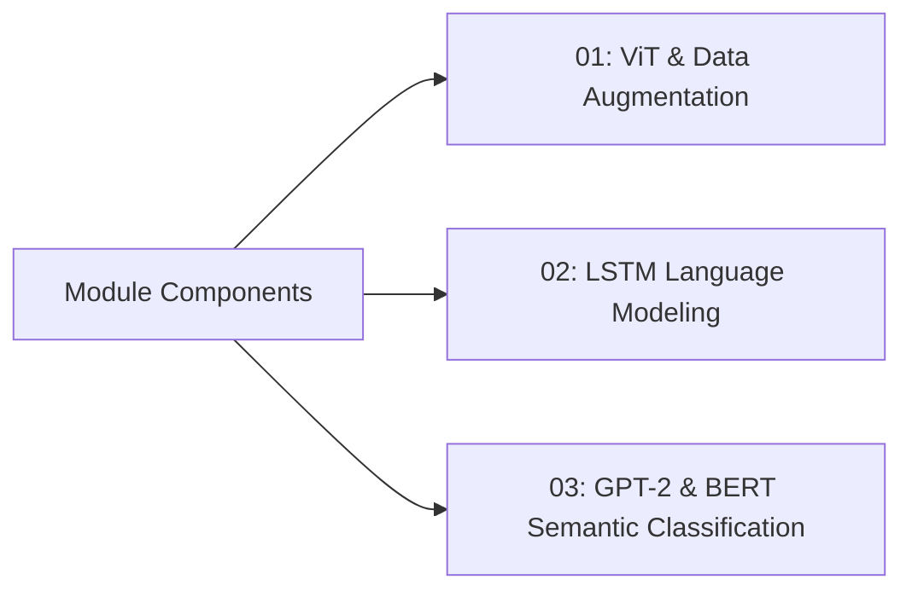

# 🤖 Vision Transformers, Recurrent Sequence Modeling & Generative Pre-training (GPT-2 / BERT)

**Author**: Muhammaderfan Bagherinejad

A comprehensive exploration of modern deep learning architectures spanning vision transformers with data augmentation, recurrent neural language models (LSTM), and transformer-based decoder and encoder representations (GPT-2 and BERT).

---

## 📌 Module Breakdown

### 🖼️ 01. Vision Transformers & Data Augmentation
- **Directory**: `01-ViT-Data-Augmentation/`
- **Notebook**: `01-ViT-Data-Augmentation/HW4_Q1_ViT_Data_Augmentation.ipynb`
- **Topics**: Fine-tuning Vision Transformers with advanced data augmentation strategies. Includes preprocessed Hugging Face Arrow datasets and PyTorch model checkpoints (`best_model.pth`, `best_model_with_augmentation.pth`).

### 📜 02. LSTM Language Modeling
- **Directory**: `02-LSTM-Language-Modeling/`
- **Notebook**: `02-LSTM-Language-Modeling/HW4_Q2_LSTM_Language_Modeling.ipynb`
- **Detailed Docs**: [`02-LSTM-Language-Modeling/README.md`](02-LSTM-Language-Modeling/README.md)
- **Topics**: Multi-layer LSTM language modeling on the WikiText-2 dataset with tied embedding weights, dropout regularization, and perplexity evaluation.

### 💬 03. GPT-2 & BERT for Sentiment Classification
- **Directory**: `03-GPT2-Sentiment-Classification/`
- **Notebook**: `03-GPT2-Sentiment-Classification/HW4_Q3_GPT2_Sentiment_Classification.ipynb`
- **Detailed Docs**: [`03-GPT2-Sentiment-Classification/README.md`](03-GPT2-Sentiment-Classification/README.md)
- **Topics**: Architectural variations on decoder-only GPT-2 (Linear Head, Aggregation Layer, Multi-head Self-Attention, Left-to-Right and Right-to-Left Attention) benchmarked against fine-tuned BERT on the Stanford Sentiment Treebank (SST-2).
