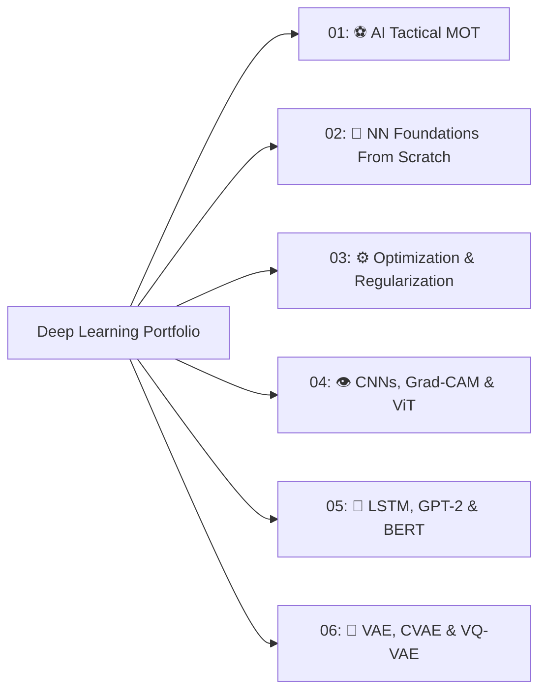

# 🧠 Deep Learning: Architectures, Computer Vision & Generative AI

[](https://www.python.org/)
[](https://pytorch.org/)
[](https://huggingface.co/)
[](https://opencv.org/)
[](https://opensource.org/licenses/MIT)

> **Course**: Graduate Deep Learning  
> **Institution**: Sharif University of Technology  
> **Instructor**: Prof. Hamidreza Fatemizadeh  
> **Author**: Muhammaderfan Bagherinejad ([GitHub](https://github.com/merfan-bagheri) • [LinkedIn](https://www.linkedin.com/in/mohammaderfan-bagherinejad))

---

## 📖 Overview

This repository contains my deep learning coursework, implementations, and capstone project developed at Sharif University of Technology. It includes an **AI Computer Vision Multi-Object Tracking (MOT) Capstone System** alongside foundational neural network engines from scratch, CNN interpretability & Grad-CAM, Vision Transformers (ViT), NLP sequence models (LSTM & GPT-2 variants), and Deep Generative Models (VAE, CVAE, VQ-VAE).



---

## 📂 Repository Structure

| Module Directory | Description | Core Topics & Tech Stack |
| :--- | :--- | :--- |
| [`01-AI-Football-Multi-Object-Tracking/`](01-AI-Football-Multi-Object-Tracking/) | **AI Multi-Object Tracking (MOT) & Tactical Football Analytics** | YOLOv5, ByteTrack, CBAM Attention, K-Means Jersey Clustering, Homography, Heatmaps |
| [`02-Neural-Network-Foundations-From-Scratch/`](02-Neural-Network-Foundations-From-Scratch/) | **Deep Learning Framework From Scratch** | Custom Modular Layers (`Linear`, `ReLU`, `Softmax`), Vectorized Backprop, Modular Solvers |
| [`03-Optimization-and-Regularization-Dynamics/`](03-Optimization-and-Regularization-Dynamics/) | **Optimization & Training Dynamics** | Adam, RMSprop, Momentum, L2 Decay, Dropout, Decision Boundary Animations |
| [`04-CNNs-GradCAM-and-Vision-Transformers/`](04-CNNs-GradCAM-and-Vision-Transformers/) | **CNNs, Grad-CAM & Vision Transformers (ViT)** | Grad-CAM Layer-by-Layer Heatmaps (0–40), Feature Hierarchies, ViT Multi-Head Self-Attention |
| [`05-ViT-Augmentation-LSTM-and-GPT2-NLP/`](05-ViT-Augmentation-LSTM-and-GPT2-NLP/) | **ViT Augmentation, LSTM & GPT-2 / BERT** | Data Augmentation, Tied-Weight LSTM (WikiText-2), 5 GPT-2 Decoder Variations, SST-2 Sentiment |
| [`06-Deep-Generative-Models-VAE-and-VQ-VAE/`](06-Deep-Generative-Models-VAE-and-VQ-VAE/) | **Deep Generative Modeling** | VAE, Conditional VAE, Latent Manifold Traversal Animation, VQ-VAE Codebook Quantization |

---

## 🌟 Featured Highlights

### 1. ⚽ Multi-Object Tracking & Tactical Football Analytics ([`01-AI-Football-Multi-Object-Tracking/`](01-AI-Football-Multi-Object-Tracking/))
- **Detection & Tracking**: YOLO object detection coupled with **DeepByteTrack** using **CBAM (Convolutional Block Attention Module)** for appearance feature extraction under occlusions.
- **Team Assignment**: Automatic jersey color clustering in HSV/RGB space via K-Means.
- **Ball Possession**: Spatial proximity and trajectory interpolation for robust ball possession determination.
- **Pitch Homography**: Perspective transformation for 2D tactical maps, speed, distance calculation, and player heatmaps.

### 2. 👁️ Model Interpretability & Grad-CAM ([`04-CNNs-GradCAM-and-Vision-Transformers/`](04-CNNs-GradCAM-and-Vision-Transformers/))
- Layer-by-layer attention visualization (layers 0 through 40) using Gradient-weighted Class Activation Mapping to observe the emergence of high-level visual features.

### 3. 💬 Transformer Architectures for NLP ([`05-ViT-Augmentation-LSTM-and-GPT2-NLP/`](05-ViT-Augmentation-LSTM-and-GPT2-NLP/))
- Architectural benchmark comparing 5 configurations of decoder-only GPT-2 (Linear head, Aggregation layer, Multi-head Self-Attention, Causal LTR/RTL attention) alongside fine-tuned BERT on SST-2.

### 4. 🎨 Latent Space Generative Modeling ([`06-Deep-Generative-Models-VAE-and-VQ-VAE/`](06-Deep-Generative-Models-VAE-and-VQ-VAE/))
- Latent interpolation animation traversing continuous Gaussian manifolds in VAE/CVAE, and discrete vector quantization in VQ-VAE.

---

## 🛠️ Environment Setup & Dependencies

```bash
# Clone the repository
git clone https://github.com/merfan-bagheri/deep-learning-and-computer-vision.git
cd deep-learning-and-computer-vision

# Create virtual environment
python -m venv dl_env
source dl_env/bin/activate  # On Windows: dl_env\Scripts\activate

# Install dependencies
pip install torch torchvision torchaudio --index-url https://download.pytorch.org/whl/cu118
pip install transformers datasets opencv-python numpy pandas matplotlib scikit-learn ultralytics
```

---

## 📜 License
This repository is open-source and available under the [MIT License](LICENSE).
