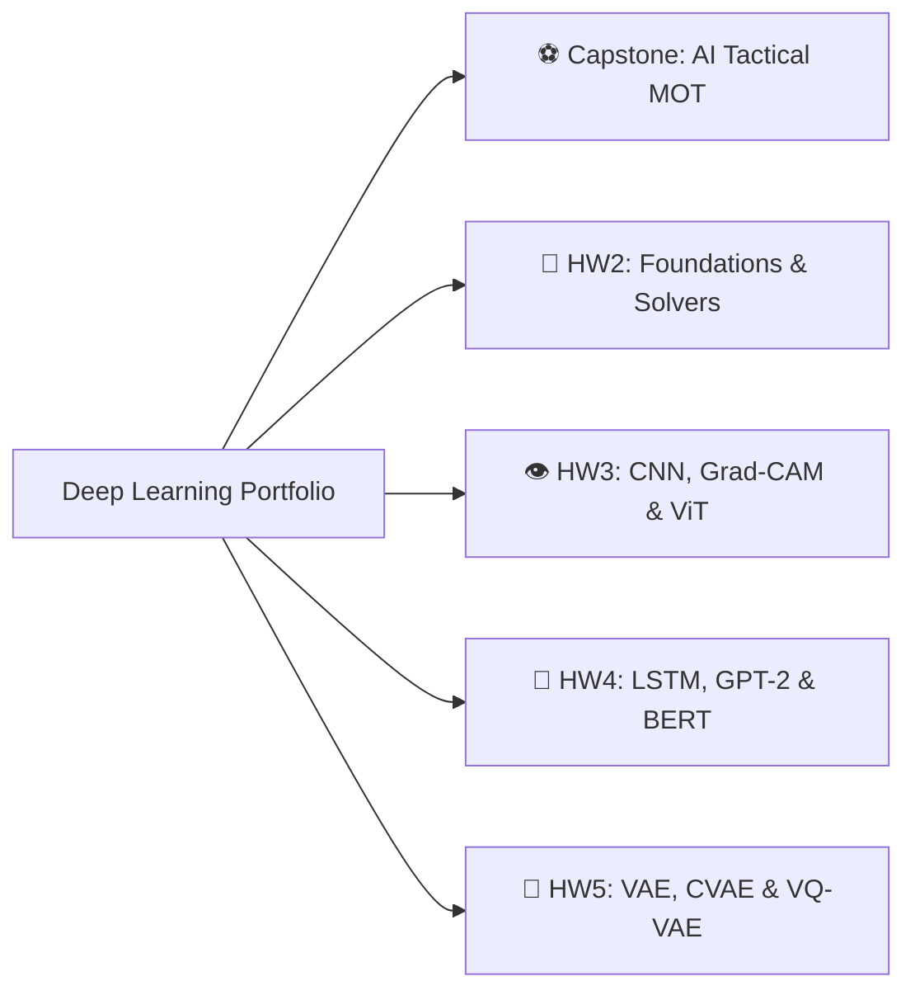

# 🧠 Deep Learning: Architectures, Computer Vision & Generative AI

[](https://www.python.org/)
[](https://pytorch.org/)
[](https://huggingface.co/)
[](https://opencv.org/)
[](https://opensource.org/licenses/MIT)

> **Course**: Graduate Deep Learning  
> **Institution**: Sharif University of Technology  
> **Instructor**: Prof. Hamidreza Fatemizadeh  
> **Author**: Muhammaderfan Bagherinejad ([GitHub](https://github.com/merfan-bagheri) • [LinkedIn](https://www.linkedin.com/in/merfan-bagheri))

---

## 📖 Overview

This repository contains a comprehensive deep learning portfolio comprising a complete **Computer Vision Multi-Object Tracking (MOT) Capstone Project** and five rigorous coursework modules covering foundations, deep CNN interpretability, Vision Transformers (ViT), NLP sequence models (LSTM & GPT-2), and Deep Generative Models (VAE, CVAE, VQ-VAE).



---

## 📂 Repository Structure

| Directory | Description | Key Technologies / Topics |
| :--- | :--- | :--- |
| [`Project/`](Project/) | **AI Tactical Football Analytics & Multi-Object Tracking** | YOLOv5, ByteTrack, CBAM Attention, K-Means Clustering, Homography, Heatmaps |
| [`hw2_1/`](hw2_1/) | **Deep Learning Framework from Scratch** | Custom Layers (`Linear`, `ReLU`, `Softmax`), Vectorized Backprop, Modular Solvers |
| [`hw2_2/`](hw2_2/) | **Optimization & Training Dynamics** | Adam, RMSprop, Momentum, L2 Decay, Dropout, Decision Boundary Visualization |
| [`hw3/`](hw3/) | **CNNs, Grad-CAM & Vision Transformers** | Grad-CAM Attention Heatmaps, Multi-layer Feature Maps, ViT Self-Attention |
| [`hw4/`](hw4/) | **ViT Augmentation, LSTM & GPT-2 / BERT** | Data Augmentation, Tied-Weight LSTM (WikiText-2), GPT-2 Causal Variations, SST-2 |
| [`hw5/`](hw5/) | **Deep Generative Modeling** | VAE, Conditional VAE, Latent Manifold Traversal, VQ-VAE Codebook Quantization |

---

## 🌟 Featured Highlights

### 1. ⚽ Multi-Object Tracking & Tactical Football Analytics ([`Project/`](Project/))
A broadcast-grade video analytics pipeline for soccer match tracking:
- **Detection & Tracking**: YOLO object detection coupled with **DeepByteTrack** using **CBAM (Convolutional Block Attention Module)** for appearance feature extraction under occlusions.
- **Team Assignment**: Automatic jersey color clustering in HSV/RGB space via K-Means.
- **Ball Possession**: Spatial proximity and trajectory interpolation for robust ball possession determination.
- **Pitch Homography**: Perspective transformation for 2D tactical maps, speed, distance calculation, and player heatmaps.

### 2. 👁️ Model Interpretability & Grad-CAM ([`hw3/`](hw3/))
- Layer-by-layer attention visualization (layers 0 through 40) using Gradient-weighted Class Activation Mapping to observe the emergence of high-level visual features.

### 3. 💬 Transformer Architectures for NLP ([`hw4/`](hw4/))
- Architectural benchmark comparing 5 configurations of decoder-only GPT-2 (Linear head, Aggregation layer, Multi-head Self-Attention, Causal LTR/RTL attention) alongside fine-tuned BERT on SST-2.

### 4. 🎨 Latent Space Generative Modeling ([`hw5/`](hw5/))
- Latent interpolation animation traversing continuous Gaussian manifolds in VAE/CVAE, and discrete vector quantization in VQ-VAE.

---

## 🛠️ Environment Setup & Dependencies

1. **Clone the repository:**
   ```bash
   git clone https://github.com/merfan-bagheri/Deep_learning_Dr.Fatemizadeh.git
   cd Deep_learning_Dr.Fatemizadeh
   ```

2. **Create and activate a virtual environment:**
   ```bash
   python -m venv dl_env
   # Windows:
   dl_env\Scripts\activate
   # Linux/macOS:
   source dl_env/bin/activate
   ```

3. **Install core packages:**
   ```bash
   pip install torch torchvision torchaudio --index-url https://download.pytorch.org/whl/cu118
   pip install transformers datasets opencv-python numpy pandas matplotlib scikit-learn ultralytics
   ```

---

## 📜 License
This repository is open-source and available under the [MIT License](LICENSE).
